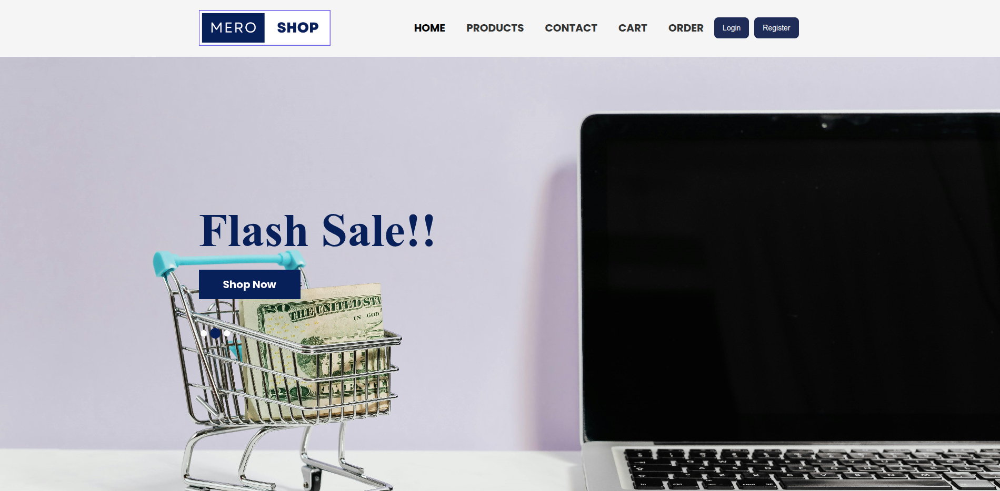
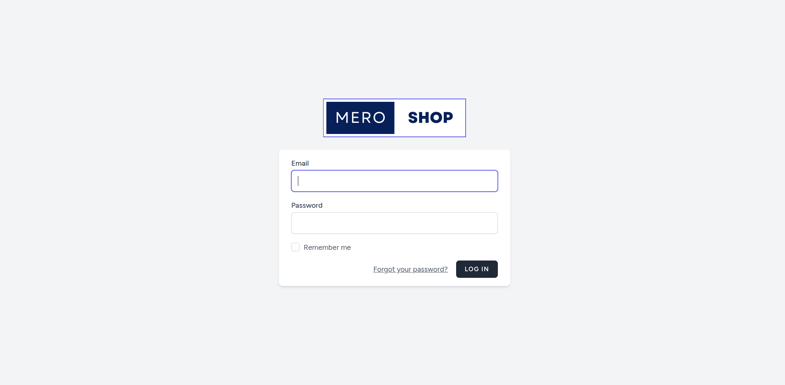

# MeroShop - E-commerce Platform

## Project Overview
This project is an e-commerce platform developed as a 6th-semester academic project. It aims to provide a comprehensive online shopping experience, allowing users to browse products, add items to a cart, and place orders.

## Technologies Used
*   **Framework:** Laravel (PHP)
*   **Database:** MySQL (or compatible)
*   **Frontend:** HTML, CSS (Tailwind CSS), JavaScript (Vite)

## Team Members
*   Saugat Dhungana
*   Anup Ghimire
*   Anil Tajpuriya
*   Nikesh Dhakal
*   Ujwal Nembang
*   Suman Basnet

## Setup Instructions

To get the project up and running on your local machine, follow these steps:

1.  **Clone the repository:**
    ```bash
    git clone <repository_url>
    cd MeroShop-Ecommerce-Laravel-
    ```

2.  **Install PHP Dependencies:**
    ```bash
    composer install
    ```

3.  **Install Node.js Dependencies:**
    ```bash
    npm install
    ```

4.  **Environment Configuration:**
    *   Copy the example environment file:
        ```bash
        cp .env.example .env
        ```
    *   Generate an application key:
        ```bash
        php artisan key:generate
        ```
    *   Open the `.env` file and configure your database connection:
        ```
        DB_CONNECTION=mysql
        DB_HOST=127.0.0.1
        DB_PORT=3306
        DB_DATABASE=your_database_name
        DB_USERNAME=your_database_user
        DB_PASSWORD=your_database_password
        ```

5.  **Run Database Migrations:**
    ```bash
    php artisan migrate
    ```
    If you want to seed the database with dummy data (if available):
    ```bash
    php artisan db:seed
    ```

6.  **Compile Frontend Assets:**
    ```bash
    npm run dev
    # or for production build
    # npm run build
    ```

7.  **Start the Development Server:**
    ```bash
    php artisan serve
    ```

The application should now be accessible in your web browser at `http://127.0.0.1:8000` (or the address shown in your terminal).

## Screenshots
The `app_ss` directory contains screenshots of the website.




## License

The Laravel framework is open-sourced software licensed under the [MIT license](https://opensource.org/licenses/MIT).